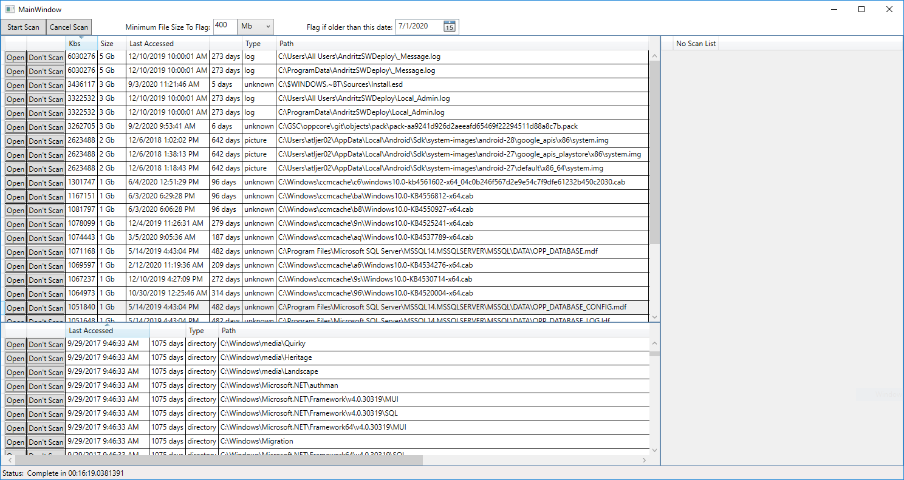

# WindowsTools
A Visual Studio .Net Core solution holding miscellaneous tools used for windows machines

## Table of contents
* [Technologies](#technologies)
* [File Scanner](#file-scanner) - Find large files unused files *system cleaning*
	
## Technologies
Project is created with:
* .Net Core 3.1
	
## File Scanner
The File Scanner is WPF project utilizing MVVM and an on disk SQLLite database with EF Core as the ORM. It is meant to be a customizable deep scanner with the ability to configure and save scanning profile settings to finding large files that are rarely used to free up system space.

